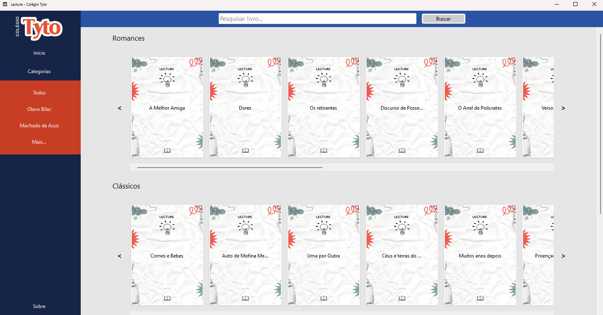
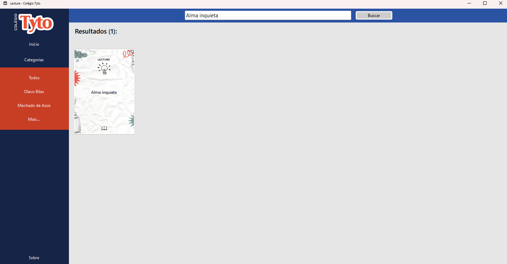
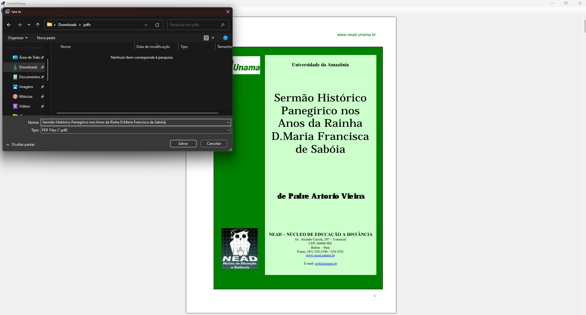
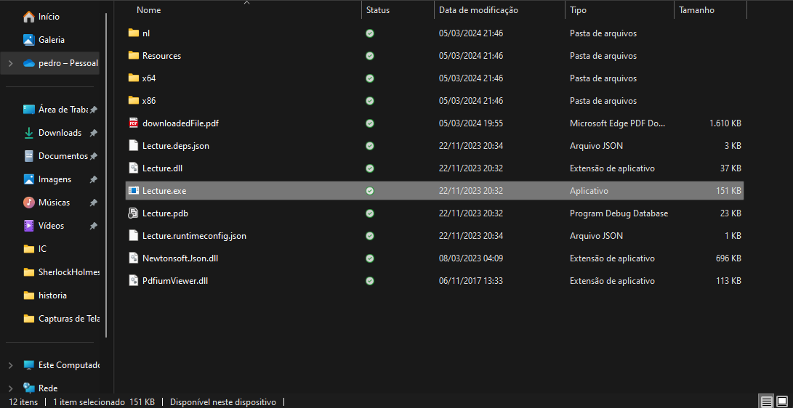

# Lecture: Explorando as Obras Clássicas da Literatura Brasileira

## Descrição

Bem-vindo ao **Lecture**, um aplicativo dedicado à leitura das obras clássicas da **literatura brasileira**. Este projeto foi desenvolvido como parte da conclusão do semestre do curso de Ciência da Computação na **Unisagrado**. O **Lecture** utiliza o acervo digital do governo brasileiro para oferecer uma interface intuitiva e organizada para a leitura dessas obras. O desenvolvimento do projeto foi uma colaboração com o **Colégio Tyto**.

## Funcionalidades

- **Interface Intuitiva:** A interface, desenvolvida em C# (WindowsForms), foi projetada para facilitar a navegação no vasto repertório de clássicos da literatura brasileira.
  
  

- **Busca Facilitada:** Use a barra de pesquisa para localizar facilmente o livro que você deseja.

  

- **Downloads Simplificados:** Acesse e faça o download dos livros com facilidade diretamente pela interface.

  

## Como Usar

1. **Baixe e Instale:** Faça o download da pasta do aplicativo e execute o arquivo **Lecture.exe**.
   
   

2. **Explore o Acervo:** Navegue pelo acervo digital disponibilizado pelo governo brasileiro e descubra obras-primas da literatura nacional.

## Colaboradores

- Pedro Luiz Tunin
- Gustavo Rodrighero Ferreira
- João Matheus Veríssimo Francisco
- Natan Coelho de Medeiros
- Viktor Bonazza Charlanti

Agradecemos por escolher o **Lecture** para sua jornada pelo mundo fascinante da literatura clássica brasileira!
